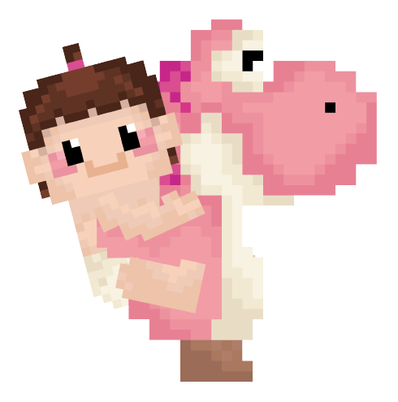

 
 
 
 

  

 

  

 
 
<h1>✨ Concept</h1>

어린 시절 플레이하던 플래시 게임의 향수를 재현하고 싶었습니다.

게임의 디자인적 요소보다는 기능 구현에 중점을 두고 작업하였습니다.

HTML, CSS, JavaScript를 사용하여 제작하였으며, 특히 JavaScript 기능을 중점적으로 활용하였습니다.

PC 5종, Tablet 1종, Mobile 3종 등 총 9가지의 기기에 적합한 화면을 제공합니다.

 
<h1>⏰ Make</h1>

졸업작품, 개인 프로젝트 입니다.

<h3>제작기간</h3>

2021.03 ~ 2021.10

<h3>사용 언어</h3>

HTML, CSS, JavaScript

<h3>기획</h3>

   이혜영 
   

  
<h3>디자인</h3>

  이혜영 

  
<h3>개발</h3>

  이혜영 

 
<h1>🖥 Responsive</h1>
<table>
  <tr>
    <th>PC</th>
    <th>Tablet & Moblie</th>
  </tr>
  <tr>
    <td>2690 x 1376</td>
    <td>768 x 481</td>
  </tr>
  <tr>
    <td>1920 x 1080</td>
    <td>425 x 481</td>
  </tr>
  <tr>
    <td>1440 x 740</td>
    <td>375 x 481</td>
  </tr>
    <tr>
    <td>1280 x 580</td>
    <td>320 x 481</td>
  </tr>
      <tr>
    <td>1042 x 642</td>
  </tr>
</table>

 
<h1>👀 How to play</h1>

 
 
 

  

  
    
https://minbok-1998.github.io/Jump-Game/
